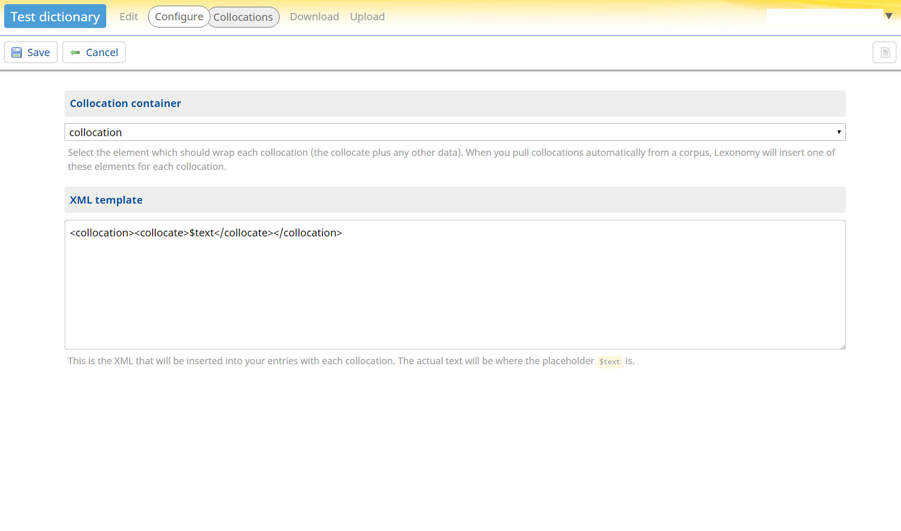

# Gentle introduction to Lexonomy

[Lexonomy](/) is a free tool for writing and publishing dictionaries and other dictionary-like things. Lexonomy runs in your web browser and all data is stored on the server, so you don't have to install anything on your computer. This page will give you a brief introduction to Lexonomy, showing you how to create a simple dictionary and how to publish it on the web.

## Registration

### Creating an account

To use Lexonomy, you first need to sign up for a Lexonomy account. For that, you need to click on Get an account on the home page, provide your email address (which will be your username) and the password will be sent to you. [Go here](/signup/) to sign up for an account. Alternatively, you can log in with your Sketch Engine account (not available on local installations). Once you have a Lexonomy account, you can login using your email and password.

### Changing your password

Once logged in, you can click on your username in the top right hand corner of the screen and open the menu. Select “Your profile” and at the bottom, there is an option for changing your password. Type in your new password and click “Change”.

### Forgot your password?

If you forgot your password, click on the “Forgot your password?” link on the Lexonomy homepage, type in the email address you used when signing up and you will receive instructions on how to create a new password.

## Creating a new dictionary

When you're logged in, the Lexonomy home page has a section titled *Your dictionaries*. That section is empty at first but there is a link to create a new dictionary.

Don't be shy about creating a new dictionary, you will always be able to delete it later and you can create as many as you want. Also, your dictionary will not be publicly visible until you decide you want it to be.

You have to give your dictionary a title and each new dictionary is automatically assigned a URL. This URL will be your dictionary’s address on the web. It can be changed later in the Configure settings.

### Creating a dictionary from a template

Finally, you have to choose whether you want to create a dictionary from a template or not. If this is your first time doing this, it is recommended that you select a template in the drop-down list. There are two templates, i.e. *simple monolingual dictionary* and *simple bilingual dictionary*.

Voilà, your dictionary is ready! Click the URL to go to its homepage.

### Creating a dictionary without a template

It is also possible to use your own XML schema. In that case you chose the option none under template. See the section on *configuring your dictionary* on how to use your own XML schema.

### Cloning an existing dictionary

You can also use an existing dictionary as a template. If you hover over an existing dictionary, two options appear behind it, i.e. delete and clone. By clicking on clone, a clone of the dictionary of your choice will be created and it will appear in the list of *Your dictionaries* under the dictionary that you have cloned.

## Editing entries

Click the *Edit* link on your dictionary's homepage and you will be taken to Lexonomy's editing interface. This is where you create and edit entries.

There is a list of entries on the left-hand side. If you had selected a template while creating your dictionary, you will see one or two sample entries here that have been created for you automatically. You can delete the sample entries if you want, and you can create as many new entries as you want. There is no upper limit to the number of entries your dictionary can contain. But for now, click one of the sample entries to see it displayed.

What you're looking at here is a pretty-printed rendering of the entry. This is what it will look like if you decide to make your dictionary public on the Lexonomy server later. To edit the entry, click the *Edit* button at the top.

Now it gets interesting! What you have here is the underlying structure of the entry, with things like headwords and senses and parts of speech marked up explicitly with XML (Extensible Markup Language).  Note that by default there are two editing views, a Nerd view and a Laic view. You can easily switch between the two views by clicking on the icons at the bottom of the editing screen. The Laic view may be slightly more user-friendly if you’re not used to working with XML.

You don't need to be an XML expert to use Lexonomy, but you do need to understand that every entry in Lexonomy is a small XML document which consists of **elements**. Each element has a name such as `headword` and consists of an **opening tag** such as `<headword>`, a **closing tag** such as `</headword>`, and text or other elements between them. The tags are there to tell us what the various pieces of text mean. You can click on any piece of text between tags and a textbox will appear allowing you to change it.

Sometimes, when you click on a piece of text between tags, you will be given a choice from a list instead of a free-form textbox. This is because Lexonomy knows what is supposed to go inside each element and acts accordingly.

If you do something Lexonomy doesn't like, such as leaving the text inside an element blank, Lexonomy will tell you by displaying a little warning triangle. You can click the warning triangle to read a description of the error.

Besides clicking on text, you can click on the element names themselves. A menu will come up listing all the actions you can perform on that element. This is how you add new examples to senses (more accurately: new `example` elements inside `sense` elements) and so on.

Notice how Lexonomy always only offers you choices that "make sense": it lets you add new examples inside senses but not inside other elements, and so on. This is because, again, Lexonomy knows what an entry is supposed to be structured like and makes sure the structure is always adhered to. This may sound limiting but it isn't, it promotes consistency: all your entries will be guaranteed to have the same structure. And besides, you can decide yourself what the structure is supposed to be. That's what we will get to next, so keep on reading.

## Configuring your dictionary

Click the *Configure* link and Lexonomy will take you to its configuration interface. This is where you can set up various things that affect the entire dictionary, i.e. **Dictionary settings**, **Entry settings**, **Publishing**, **External data sources**.

### Dictionary settings

#### Name and description

This setting allows you to change the name of your dictionary, and provide its description (e.g. size, last time of update, authors, how to reference it etc.). You can use more advanced presentation format with MarkDown. Don't forget to click the *Save* button if you change anything here!

#### Users

Another thing you have control over is who has access to the dictionary and who can make changes there, beside yourself. This can be found under *Users*. You will see your own e-mail address listed there. This means that you have access to this dictionary. To add another user, type their e-mail address into the text box and click *Add*, and then select the level of access for them:

- Edit: they will be able to edit the dictionary entries.
- Configure: they will be able to enter Configure options.
- Download: they will be able to download dictionary entries.
- Upload: they will be able to upload new entries.

Be careful about *Configure:* users who have access to this can do what you're doing now, which means they could even remove you as a user or downgrade your access privileges. If you have a team of people collaborating on a single dictionary, it's a good idea that only one of them has access to the configuration interface.
If you want to give the new user a view-only access (relevant only for private dictionaries), then add them without selecting any of the above options. Again, don't forget to click the *Save* button afterwards.

Once you've saved the user list, any users on that list will have access to your dictionary – provided they have a Lexonomy account. The next time they log in, they will see the dictionary listed under *Your dictionaries* on the Lexonomy homepage.

### Entry settings

#### Entry structure

Another thing you have control over in the configuration interface is the structure of entries: what elements are allowed to be there, what content is supposed to be inside them and so on. You'll find all that under *Entry structure* in the *Configure* section.

You may get the impresion that this part of Lexonomy is overwhelmingly complex. Don't let that bother you, it's not for beginners. If you have started your dictionary from a template, everything here has already been set up for you and you don't need to come near it. If, on the other hand, you have worked with XML Schemas or DTDs (= Documents Type Definitions) or similar things before, you will find this familiar: Lexonomy's formalism for specifying the structure of entries is about as expressive as a DTD.

One last warning before we move on. At the beginning of your project when the dictionary is empty, you can change the entry structure as much as you want. Later on, though, once you've created some entries, you need to tread carefully. Don't make changes that would disturb entries you've created already. For example, do not rename elements that are already in use in the entries, and do not change the hierarchy of parent and child elements. That would cause your existing entries to become "invalid" (there will be warning triangles everywhere) and you will have to correct them manually one by one. The rule of thumb is, do add but do not take away.

#### Subentries

Lexonomy provides the option of subentries. That is, while defining the entry schema, you can designate certain sections of the XML tree, for example phraseological subentries, to be ‘shareable’, turning them into snippets of XML which are allowed to appear in several entries simultaneously. All the elements you list here will be treated as subentries by Lexonomy, and you will be able to share them among several entries. Shareable subentries have a shaded background in the editing interface and are followed by a button which tells you how
many other entries, besides this one, share this subentry.

#### Headwords

This section allows you to configure the headword list and its display. You can select the element which contains the entry's headword. If you make no selection here Lexonomy will try to guess what the headword of each entry is. You can also adjust the order of the headwords in the entry list by specifying the element that should be used for sorting, e.g. part of speech and you can hard-code the alphabetical order that should be used for sorting.

In this section you can also specify any elements whose content you want be displayed beside the headword in the entry list, such as homograph numbers or part-of-speech labels.

#### Flags

In this section, you can set different flags (coloured circles) to each entry in order to be able to easily monitor its status. This can then be used to control the workflow in your project. To be able to use this function, each entry needs to have a specific element containing one of the values you have selected for your workflow. For example, let's say you have three stages:

1. automatic entries not yet checked by lexicographers: status = AE (automatic entry)
2. entries checked by a lexicographer: status = L (lexicographer)
3. entries confirmed by the editor: status = C (complete)

Each entry needs to have an element, let's say `<status>`, into which one of these values is put. Then, you need to select that element in the Flags section, and enter the value and (optionally) explanatory label, and choose the colour for each status type. This information is then visualised in the form of a coloured circle next to each headword. By clicking on the circle, you can see the label of the status (if provided), and change the status of the entry.

#### Search
The search section allows you to specify searchable elements. The contents of elements you select here will be searchable (in addition to each entry's headword) in the search box on top of the headword list on the editing screen.

### Publishing

#### Entry formatting

This is where you tell Lexonomy what your entries should look like to the end-user: which parts should be in which font and so on. If you have worked with CSS (Cascading Stylesheets) or XSL (Extensible Stylesheet Language) before, you will be at home here. If not, leave the worrying to us and start your dictionary from a template.

#### Public access

Lexonomy is not just a tool for writing dictionaries, it is a tool for making dictionaries publicly available on the web too. Doing that is almost effortless, you just need to change a few things in the configuration: go into *Public access* and change the access level from *Private* to *Public*.

From the moment you click the *Save* button, your dictionary will be publicly viewable.

When you visit the dictionary's homepage now, you will notice that it has changed: it now contains a searchbox and a few other things that allow people to search and browse the dictionary.

You can of course change the dictionary back to *Private* any time. One thing you need to be aware of is that when making a dictionary public, you're making it available under an open-source licence. The exact type of licence is up to you and can be selected in *Public access* in the *Configure* section, as you've probably noticed. All the options available there are open-source licences which allow other people to reuse your data freely, without the restrictions of copyright (the only thing they are legally required to do is acknowledge you publicly as the author of the data).

### External data sources

Your Lexonomy dictionary can be paired up with [Sketch Engine](https://www.sketchengine.co.uk/), a popular corpus query system. Lexonomy has a feature which allows you to "pull" example sentences and other things from a Sketch Engine corpus and, vice versa, Sketch Engine has a feature that allows you to "push" an entire pre-generated dictionary into Lexonomy (and then post-edit it there).

#### Sketch Engine connection

In this section you will find options for configuring your connection with the Sketch Engine. Sketch Engine URL, Sketch Engine API URL and Corpus name are mandatory fields, others are optional.

#### Examples

Here you configure the pulling of example sentences from Sketch Engine. You need to select the element in which every example will be wrapped, then provide an XML template for every example that will be inserted into your entries, and select the element that marks the headword in the entries, if relevant.

#### Collocations
Here you configure the pulling of collocations from Sketch Engine. You need to select the element in which every collocation will be wrapped, then provide an XML template for every collocation that will be inserted into your entries.

#### Thesaurus items

Here you configure the pulling of thesaurus items from Sketch Engine. You need to select the element in which every thesaurus item will be wrapped, then provide an XML template for every thesaurus item that will be inserted into your entries.

#### Definitions

Here you configure the pulling of definitions from Sketch Engine. You need to select the element in which every definition will be wrapped, then provide an XML template for every definition that will be inserted into your entries.

## Download

Lexonomy offers the ability to download your entire dictionary (under the *Download* link). It is a good idea to this regularly, as a form of backup. If for any reason the server failed and your data got lost, you would be able to recover everything from your latest download. Do bear in mind that Lexonomy doesn't provide any guarantees and we do not make any backups on the server, so it is up to you to take care of that.

## Upload

Another interesting feature is the ability to upload existing data into Lexonomy instead of creating all entries by hand. This is available under the *Upload* link. It is an advanced feature, though, and you would be well advised to shy away from it unless you know exactly what you're doing. The data you're uploading must be in XML and must comply exactly with the entry structure as specified in your configuration or you must upload your own XML schema as well. If you tick the box *purge before upload* all data which is currently in your dictionary will first be permanently erased and removed from your dictionary.

## Conclusion

This brings us to the end of this introduction. You can read more about Lexonomy in the paper [Introducing Lexonomy: an open-source dictionary writing and publishing system](elex2017.pdf).
